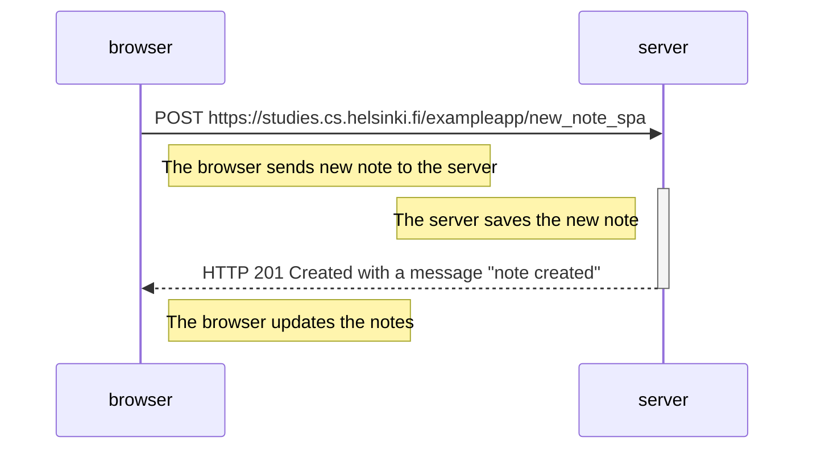

```mermaid
sequenceDiagram
    participant browser
    participant server 

    browser->>server: POST https://studies.cs.helsinki.fi/exampleapp/new_note_spa
    Note right of browser: The browser sends new note to the server
    activate server
    Note left of server: The server saves the new note
    server-->>browser: HTTP 201 Created with a message "note created"
    deactivate server

    Note right of browser: The browser updates the notes
```